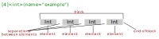

======================================================
File Format Description Language Specification
======================================================

:Authors: Hailing Fang
:Email: hailing.fang@outlook.com
:Version: 0.3.1
:Create Date: 20230401
:Update Date: 20260605

Introdution
======================

.. raw:: html

    

File Format Description Language (FFDL) is a language for describing the
format/layout of binary or plaintext files.

It has two components: FFDL sentences and FFDL programming language stataments.

FFDL Sentences
======================

The FFDL sentences are used to describe data blocks of files.

A sample FFDL sentence have three parts: [...], <...> and (...).

There is an example of a FFDL sentence::

    [5]<int>(name="sample sentence")

The '[...]' is count part of the FFDL sentence, and is necessary.

The '<...>' is element part of the FFDL sentence, and is necessary too.

The '(...)' is label part of the FFDL sentence, and is optional.

A complex FFDL sentence use '{...}' instead of the '<...>' part. The '{...}'
is used to holding the FFDL sentences.

For example::

    [2]{
        [2]<int>
        [1]<double>
        [8]<uint8>
    }(name="comple sentence")

The '[...]' Part
------------------------

The '[...]' part of a FFDL sentence is called **count part**.

Where '...' can be an expression. The value of the expression is 0 or a positive integer
that representing the number of elements defined by '<...>' part in the FFDL sentence.

Example::

    [2 + 3]<int>

The '...' can be an array of 0 or positive integer. It represent that a block with
complex element.

Example::

    [[1, 2, 3]]<[int, int, float]>
    
    #is equal to:
    [1]{
        [1]<int>
        [2]<int>
        [3]<float>
    }

For sometimes, the number of elements vary, and is depended on the actural data file that
FFDL described. To address this, the '...' can be an range write as '(a, b)' to express
that the number of element is between a and b, where a and b are included. If 'b' is
missed, the range of the number is a to the positive infinaty.

Example::

    [(5, 10)]<int>
    [(4, )]<float>

Because the count range: '(0, 1)', '(0,)' and '(1,)' is used frequently.
There are three shortcut mark for them.

Example::

    [(0, 1)]<int>
    #equals to
    [?]<int>

    [(0, )]<int>
    #equals to
    [*]<int>

    [(1, )]<int>
    #equals to
    [+]<int>

The '...' can be a choice for number that embraced by '{}'.

Example::

    [{0, 1, 3}]<int>

The value of count part can be refered by a *variable*. For underterminated
count number this may do some help for convience.

Example::

    [(0, ); :count_num]<int>

There are some complex examples::

    [[{1, 2, 3}, {4, 5, 6}, {7, 8, 9}]; :[va, vb, vc]]<[int, float, double]>
    [[(1, 2), (4, 5), (7, 8)]; :[xa, xb, xc]]<[int, int, int]>

.. note::

    Although an array is allowd  in count, you would better to use scalar to
    keep FFDL sentences sample and clear.
    Use '{...}' to describe complex structures.

The '<...>' Part
-------------------------

The '<...>' part of a FFDL sentence is called **element part**.

The '...' is a element type. There are element types that have been defined.

=============== ============ ===================================================
Element Type    Byte Size    Note
=============== ============ ===================================================
bit             1/8          1 bit
byte            1            8 bits       
char            1            a signed 8 bits integer
int8            1            same as 'char'
uint8           1            an unsigned 8 bits integer
short           2            signed 16 bits integer
int16           2            same as 'short'
uint16          2            an unsigned 16 bits integer
int             4            a signed 32 bits integer
int32           4            same as 'int'
uint32          4            an unsigned 32 bits integer
long            8            a signed 64 bits integer
int64           8            same as 'long'
uint64          8            a unsigned 64 bits integer
float           4            a 32 bits float number
float32         4            same as 'float'
double          8            a 64 bits float number
float64         8            same as 'double'
string          vary         only used for plaintext file, the string do not
                             contain white characters by default
=============== ============ ===================================================

The '...' can be an array of element type.

Example::

    [4]<int>
    [[2, 3, 4]]<[int, char, double]>

In element part, the values that stored in file actural can be asserted to should
to specific values.

Example::

    [1]<int; =5>
    [3]<float; =[1.0, 3, 4.8]>

The value that store can be asserted that should within a range. The
number for range is write in '()', if edge value is not include, use '-'
to represent this. '-(1, 4)-' mean 1 to 4, but 1 and 4 is not include
in the range.

Example::

    [1]<int; =(5, 9)>
    [2]<float; =[(4, 7)-, (9, 10.03)]>

The value that store can be asserted should be an option of choices.

Example::

    [1]<int; ={1, 2}>
    [3]<float; =[{1, 2}, {4, 5}, {5, 6}]>

Can compare a specific element with a value and assert them equal.

Example::

    [5]<int; [2]=4>

Can assert that all element in the block should equal to a specific number.
Or a slice be equal to a specific number.

Example::

    [100]<int; [:]=7>
    [1000]<int; [0:10]=2>

A slice of block's element can compare with an array.

Example::

    [100]<int; [0:4]=[1, 2, 3, 4]>

For the asserting about choices and range of a specific element or slice of element
is same to the comparision with values.

Example::

    [100]<int; [:]={1,2,3}>
    [1000]<int; [:4]={3, 4, 5}>
    [1000]<int; [:4]=[{1, 2, 3}, {4, 5, 6}, {7, 8, 9}, {10}]>

    [100]<int; [:]=(10, 15)>
    [100]<float; [:4]=(1, 4)>
    [100]<float; [:4]=[(1, 2), (4, 5), (6, 7), -(100, )]>

The elements can be refered by variables. If the data block has only one element,
the variable refer to a scalar, otherwise an array.

Example::

    [1]<int; :a>
    [4]<float; :b>

The a slice of block can be refered by a variable.

Example::

    [100]<int; [:]:x>
    [100]<int; [:10]:y>
    [[10, 20]]<[int, float]; [[:], [:4]]:[x, y]>

.. note::

    In order to keep FFDL sample and clear, user should shoud use labels in '(...)'
    for some long string in '<...>'.

The '(...)' Part
--------------------------

The '(...)' part of FFDL sentence is called **label part**.

In this part, labels with a label name and a label value is added. The label value is
embraced by '""'.
The labels can record all information including that in **count part** and **element part** part.
So user can let count part and element part empty, and record the information by
labels.

Example::

    [4]<int; [:]=5>
    #equals to
    []<>(count="4";
         element_type="int";
         element_value="[:]")

Here is labels that can replace the '...' in '[...]' and '<...>'.

============================ =========================== =============================================
Label Name                   Label Value                  Example
============================ =========================== =============================================
count_type                   element_number,             []<>(count_type="element_number")
                             byte_length,
                             offer.
                             The defaule is
                             element_number                      
element_number               an expression               []<int>(element_number="12")
byte_length                  an expression               [4]<int>(byte_length="16")
offset                       an expression               [1]<char>(name="filetype", offset="0")
count                        an expression               []<int>(count="4")
count_range                  an range                    []<int>(count_range="(4, 10)")
count_choices                a choices                   []<int>(count_choices="{4, 5, 6}")
count_reference              a variable name             [1]<int>(count_reference=":var")

element_type                 element_type                [1]<>(element_type="int")
element_value                a scalar or array           [3]<int>(element_value="=[1,2,3]")
element_value_range          an range                    [4]<int>(element_value_range="[:]=(1, 10)-")
element_value_choices        an choices                  [4]<int>(element_value_choices="[:]=2")
reference                    a variable                  [4]<int>(reference=":x")
============================ =========================== =============================================

Here are other labels that have been defined. The use can define there own labels.

============================ =========================== =============================================
Label Name                   Label Value                  Example
============================ =========================== =============================================
name                         a name for the data block   [2]<int>(name="header block")
id                           a uinque id for a block     [32]<float>(id="magic_number")
description
lthan                        a number that value of      [5]<int>(lthan="[:]<12")
                             elements should less than   
lethan                       a number that value of      [5]<int>(lethan="[:]<=12")
                             elements should less
                             equal than   
gthan                        a number that value of      [5]<int>(gthan="[:]>12")
                             elements should greater
                             than   
gethan                       a number that value of      [5]<int>(gethan="[:]>=12")
                             elements should greater
                             equal than   

encode                       if the block represent a    [*]<char>(encode="ascii")
                             string, give the encoding
                             schame
string_end_marker            0                           should be 0, if present in labels
                                                         part, the string is marked end with
                                                         \0 
NA                           the value for NA            [1]<string>(NA="0")
apple                        apple a function to data    [100]<byte; :x>(apply="res=decode(x)")
                             block                       
============================ =========================== =============================================

Some labels that may useful for a plaintext file.

============================ =========================== =============================================
Label Name                   Label Value                  Example
============================ =========================== =============================================           
regex_pattern                regular expression that     [1]<string>(regex_pattern="^\w") 
                             should match the string                
block_end_with               a block end with            [*]<char>(string_end_marker="0";
                                                         block_end_with="\n")
elements_separator           elements separator          
sorted                       the elements are sorted     [10]<int>(sorted="increase")
sorted_fun                   the function be use when    [10]<string>(sorted_fun="lambda x: int(x)")
                             comparing
order_reference              represent the of elements   [100]<int>(order_reference="name_order") 
align_with                   the element in this block   [100]<string>(align_with"name_order")
                             should align with the
                             order. The order matters                           
============================ =========================== =============================================

The '{...}' part
--------------------------

The '{...}' part of a FFDL sentence is called **complex element part**.

It is used to construct a complex element.

Example::

    [2]{
        [1]<int>
        [2]<char>
        [4]<float>
    }

The element is make of one int, follwed by 2 char, and then 4 float.

The '{...}' can be emplemented in another '{...}'.

Comment FFDL Sentences
---------------------------------

If a '#' present in '[...]' part after '[', the sentence is a comment.

Example::

    [#4]<int>()

Concepts and Terminology
----------------------------

A FFDL describe a **data block**. The data block is make of **element** described by
'<...>' part or '{...}' part.

Diagram for the block and elements of block. 

A '{...}' if a FFDL sentence make a **complex elements**. The block is make 
of one or more complex elements. 

The **end of blocl** is data at the end of a block.
The **element separator** is data between elements.
Those two concepts is useful in plaintext FFDL repretension.

FFDL Programming Language Stataments
==========================================

The FFDL programming language stataments are use to do calculation and flow control.
It works like C and Python programming language.

Variable
---------------------

The rule for naming a variable is same as it in C or Python.

Data Types
----------------------

Number and String
~~~~~~~~~~~~~~~~~~~~~~~~

Integer, float and string are support in FFDL programming language. A char in ''
is a integer same as in C. The string can be concatenated by '+' operator.

Example::

    a = 12;
    b = 3.14;
    c = "hello world"
    d = 'a'

List and Dictionary
~~~~~~~~~~~~~~~~~~~~~~~~~

List and dictionary are implemented in FFDL programming language.
It behave just like it in Python, even the attributes of the it are
same as it in Python.

Example::

    li = [1, 2, 'a', "hello"]
    li.append(3)
    dic = {"ab": 1, 2: "bc"}

Built in Variables/Object
~~~~~~~~~~~~~~~~~~~~~~~~~~~~~~~~~~~~

There are built in variables or objects to refer to specific objects.

================= =============================== ==============================
objects           notes                              example
================= =============================== ==============================
fileself          refer to the file that          fileself.open("rb");
                  described                       fileself.seek(8, 0);
                                                  #move to files' offset 8
None              refer to nothing                a = None;
================= =============================== ==============================

Expression
-------------------------

Numbers, string, functions operated by operators make an expression.

Arithmetic Operators
~~~~~~~~~~~~~~~~~~~~~~~~~~

============== ================ ================================================
Operators      Name             Examples
============== ================ ================================================
\+             plus             3 + 4; "hello " + "world"
\-             minus            3 - 4
\*             mulitiply        2 * 3 
/              divide           4 / 3
//             integer divide   4 // 3
%              mod              4 % e
\*\*           expernation      2\*\*3
=              equal            var = var * 2
============== ================ ================================================

The operatons that '++', '--', '+=', '-=', '\*=', '/=', '//=', '%=', '\*\*=' are also
supported. 

Relational and Logical Operators
~~~~~~~~~~~~~~~~~~~~~~~~~~~~~~~~~~~~~~~

============== =================== =============================================
Operators      Name                Examples
============== =================== =============================================
>              greater than        4 > 3
>=             greater equal than  4 >= 3
<              less than           4 < 3 
<=             less equal than     4 <= 3
==             be equal            4 == 3
!=             not equal           4 != 3
&&             logical 'and'       0 && 1
\|\|           logical 'or'        0 \|\| 1
!              logical 'not'       !(3)
============== =================== =============================================

Bitwise Operators
~~~~~~~~~~~~~~~~~~~~~~~~~~~~~~~~~~~~

FFDL programming language support bitwise operatons, the behavior is just like that
in C.

============== ===================== ============================================
Operators      Name                  Examples
============== ===================== ============================================
&              bitwise AND           8 & 0
\|             bitwise inclusive OR  8 \| 0
^              bitwise exclusive OR  8 ^ 0
<<             left shift            2 << 2
>>             right shift           16 >> 2
~              one's complement      ~8
============== ===================== ============================================

Statament
----------------------

A expression with with a ';' make a statament.

There are other stataments that make FFDL programming language control complete.

Conditions
~~~~~~~~~~~~~~~~~~~~~

.. code::

    if (Expression) {
        stataments or FFDL sentences;
    } elif (Expression) {
        stataments or FFDL sentences;
    } else {
        stataments or FFDL sentences;
    }

Example::

    [1]<uint16; :num>
    [1]<int; :flag>
    if (flag == 1) {
        [3]<float>
    }
    elif (flag > 1) {
        [4]<float>
    } else {
        num_char = flag * num;
        [num_char * 2]<char>
    }

.. note::

    A label part can be added to 'if' statament. For example:
    if (1) {[10]<int>}(id="block_x").
    Same is true for 'for', 'while' and 'goto' stataments.

Loops
~~~~~~~~~~~~~~~~~~~

Two types of 'for' stataments supported, one behave like it in C, and another
behave like it in Python. The statament 'continue' and 'break' are support in a
loop.

.. code::

    for (init_Expression1; compare_Expression2; calcu_Expression3) {
        stataments or FFDL sentences;
    }

    for (ele in ele_s) {
        stataments or FFDL sentences;
    }

Example::

    for (i = 0; i < 10; i++) {
        [i**2]<char>
    }

    ele_s = [1, 2, 3];
    for (ele in ele_s) {
        var = ele * 2;
        [var]<int>
    }

The 'while' statament is supported.

.. code::

    while (Expression) {
        stataments or FFDL sentences;
    }

Example::

    x = 10;
    while (x > 0) {
        [3]<float>
        x--;
    }

If a data block have n elements, where n greater than 1, the stataments in '{...}' will
execuate n times.

Example::

    y = [];
    [3]{
        [1]<int; :x>
        y.append(x)
    }

In the example, the y list will have 3 elements that stored in the data block.

goto statament
~~~~~~~~~~~~~~~~~~~~~~~

The FFDL programming language support 'goto' statament, the 'goto' should follow
a integer for offset from described file's begaining.

.. code::

    goto (offset) {
        stataments or FFDL sentences;
    }

Example::

    [1]<uint32; :data_start_offset>
    goto (data_start_offset) {
        [1]<int>
        [24]<double>
    }

Define Functions
----------------------

.. code::

    fun func_name(args, ...) {
        stataments;
    }

Example::

    fun test(a, b) {
        return a + b;
    }

Built in Functions
~~~~~~~~~~~~~~~~~~~~~~~~~~~~~~~

============== =========================== ===================================
Functions      Notes                       Example
============== =========================== ===================================
sum            sum list of integer         a = [1, 2, 3];
                                           b = sum(a);
len            get length of a list or     len([1, 2, 3]);
               dictionary.               
int            convert a string to int     int("123");
str            convert a number to string  str(123);
float          convert integer to float    float(123);
open           open a file                 open('require.txt');
============== =========================== ===================================

Other Stataments
-----------------------------

================ =============================================
statament        example
================ =============================================
assert           assert 1 == 2;
raise            raise "an error";
import           import FFDL_modul;
export           export an_variable;
require          require infor.txt;
def              def filetype plaintext;
deflabel         def optional "the value is bool, if True
                 the block is not required"
================ =============================================

import and export stataments
~~~~~~~~~~~~~~~~~~~~~~~~~~~~~~~~~~~~~~~~~

FFDL programming language can import other FFDL file format description file as
a module/library. The export variable will visiable in importing FFDL file.

Example::

    #lib.FFDL
    export x;
    export add;

    x = 123;
    fun add(x, y) {return x + y;}

    #b.FFDL
    import lib;

    [lib.x]<int; :x_value>
    y = add(x_value[0], x_value[1]);

require stataments
~~~~~~~~~~~~~~~~~~~~~~~~~~~~~~~~~

Some, a FFDL file would like to offer a function that parse the store data into
a data structure. When doing this, other file make need.

Example::

    #in FFDL1.FFDL file 1
    def filename file_a

    #in FFDL file 2
    import FFDL1;
    require file_a;

    fin = open(file_a);
    lines = [line.rstirp() for line in fin];

def stataments
~~~~~~~~~~~~~~~~~~~~~~~~~~~~

To define some attributes of described file.

Example::

    def filetype binary;
    def encode ascii;
    def filename fname_a;

When the FFDL file is imported by other FFDL file, the define attributes is visiable
to it.

deflabel stataments
~~~~~~~~~~~~~~~~~~~~~~~~~~~~~~

If defined labels used in '(...)' not satify user's requirements. One can define
labels, to extend meaning of FFDL sentences.

Comments in FFDL Programming Language
----------------------------------------------------

A line start with '#', the line is a comment.

For example::

    # [3]<int>

Contents within '/*' and '*/' are regard as comments.

For example::

    /*
        [3]<int; float_num>
        [float_num]<float>
    */
