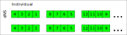

Plink BED file
======================

The Plink BED file is used to store genotype data for individuals 
and must be accompanied by the .bim and .fam files. Both the .bim and .fam
files are plaintext files, with the .bim file containing variable information
and the .fam file containing individual information

Fam file
------------------

Fam file is a plaintext file without header line. and one line per sample with six fields.

FLML description
~~~~~~~~~~~~~~~~~~~~~~

.. code::

    def filetype plaintext;
    def encode ascii;
    export line_num;
    export fam_line_order;

    [+:line_num]{
        [1]<string>(name="family ID"; id="f1")
        [1]<string>(name="within family ID"; id="f2")
        [1]<string>(name="within famfile ID of father"; id="f3")
        [1]<string>(name="within family ID of mother"; id="f4")
        [1]<string>(name="sex code"; choices={"1", "2", "0"}, datatype=int; NA="0"; id="f5")
        [1]<string>(name="phenotype"; choices={"1", "2", "-9", "0"}; datatype=int; NA={"0", "-9"}; id="f6")
    }{element_end="\n"; element_sub_sep_file_scope={'\t', '\s'}; id="file"; order=fam_line_order}

    [# Notes by ID:
        f5: The string should be converted to a intager value.
            The value 1 for male, 2 for female, 0 for unknow.
        
        f6: The string should be converted to a intager value".
            The value 1 for control, 2 for case, -9 or 0 for missing.

        file: The file should open as plain text; The number of the file's line file is not fix;
            The actural line number is referenced by variable line_num.
    ]

Bim file
----------------

Extended variant information file accompanying a .bed binary genotype table. have no
header line, and each line contain six fields.

FLML description
~~~~~~~~~~~~~~~~~~~~~~

.. code::

    def filetype plaintext;
    def encode ascii;
    export line_num;
    export bim_line_order;

    [+:line_num]{
        [1]<string>(name="chromosome code"; NA="0"; id="f1")
        [1]<string>(name="variant identifier")
        [1]<string>(name="position in morgans or centimorgans", datatype=float, NA="0"; id="f3")
        [1]<string>(name="base pair position"; datatype=int; NA="0")
        [1]<string>(name="allele 1")
        [1]<string>(name="allele 2")  
    }(element_end="\n"; element_sub_sep_file_scope={'\t', '\s'}; id="file"; order=bim_line_order)

Bed file
----------------

FLML description
~~~~~~~~~~~~~~~~~~~~~~~~~

.. code::

    def filetype binary;
    def enddianess little;
    import math
    import fam_format;
    import bim_format;
    require famfile;
    require bimfile;

    [3]<byte; =[0x6c, 0x1b, 0x01]>(name="magic number")
    [bim_format.line_num]{
        [fam_format.line_num]{
            [2]<bit>(id="byte_genotype")
        }(align_with=fam_format.fam_line_order)
        if (fam_format % 4 > 0) {
            [4 - fam_format.line % 4]{
                [2]<bit; =[0, 0]>(name="filling bits")
            }
        }
    }(align_with=bim_format.bim_line_order)

    [# Notes for ID
        byte_genotype:
            00: Homozygous of first allele in .bim file.
            10: Heterozygous.
            11: Homozygous of second allele in .bim file.
            01: Missing
    
    ]

Individuals order across byte
-------------------------------------

References
-------------------

https://www.cog-genomics.org/plink/1.9/formats#fam

`bed file <https://www.cog-genomics.org/plink/1.9/formats>`_

`plink2R <https://github.com/gabraham/plink2R/blob/master/plink2R/src/data.cpp>`_

